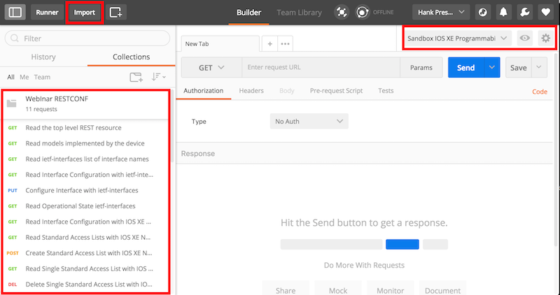

# RESTCONF Webinar

Code and Samples for my webinar on RESTCONF

# Pre-Reqs 
## DevNet Sandbox 
You'll need a device running a RESTCONF Agent (RFC 8040 Compliant) to complete these exercises.  A great recommendation available is the [IOS XE Programmability Sandbox](https://devnetsandbox.cisco.com/RM/Diagram/Index/7fd27b24-7034-477d-9ad2-e2c8096dd1a5?diagramType=Topology).  There is no cost to use this sandbox, just sign up for a DevNet Account if you don't already have one.  

## Postman
This webinar leverages [Postman](http://getpostman.com) to execute the RESTCONF calls.  

# Setup and Getting Started 
This repository includes two files that you can import into Postman to quickly get started with the API calls in the webinar.  

* `devnet_sandbox_iosxe_programmability.postman_environment` 
    * Creates a Postman Environment (ie variables) that has the IP, User, and Password for the DevNet Sandbox pre-configured 
* `restconf_8040_examples.postman_collection`
    * A Postman Collection of RESTCONF API calls

## Import into Postman 

Open Postman and click `Import` from the upper right corner and select both files that are contained in the repository.  

# Run the Examples 

Now you can begin running the RESTCONF calls from the Collection!  